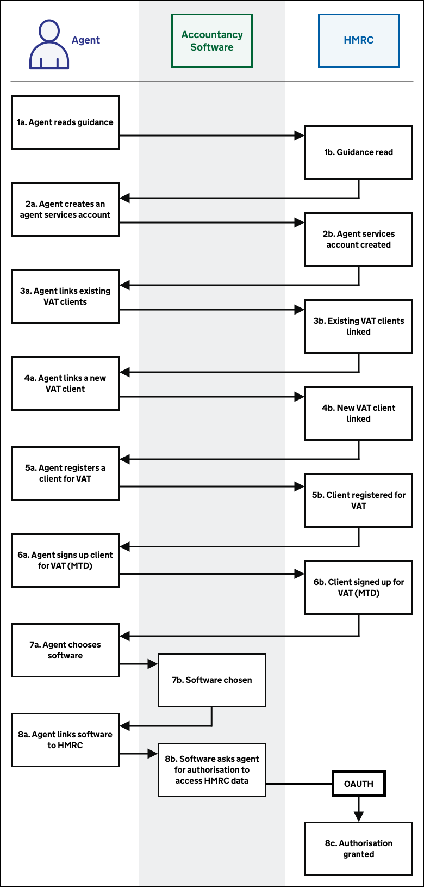
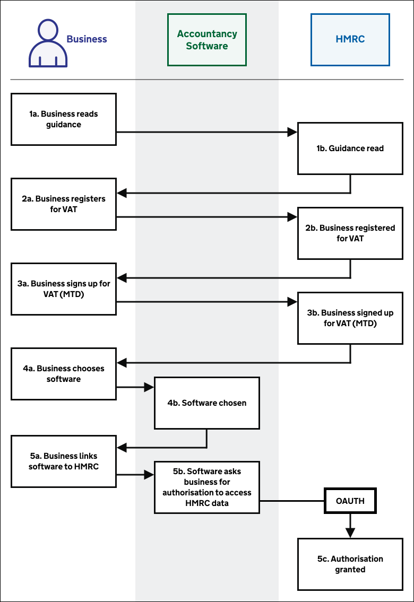

# End-to-end user journeys

## Agent journey overview 

Before agents can represent clients they must set up their relationships and software.

<a href="figures/agent-journey-overview.svg" target="blank">Open the agent set up process diagram in a new tab</a>.

1. [Agent reads guidance](#read-guidance)
2. [Agent creates an agent services account](#create-an-agent-services-account)
3. [Agent links existing VAT clients](#link-existing-vat-clients)
4. [Agent links a new VAT client](#link-a-new-vat-client)
5. [Agent registers a client for VAT](#register-for-vat)
6. [Agent signs up client for VAT (MTD)](#agent-signs-up-client-for-vat-mtd)
7. [Agent chooses software](#choose-software)
8. [Agent links software to HMRC](#link-software-to-hmrc)

## Business journey overview 

Before businesses can submit VAT Returns, they must sign up for VAT (MTD) and set up their software.

<a href="figures/business-journey-overview.svg" target="blank">Open the business set up process diagram in a new tab</a>.

1. [Business reads guidance](#read-guidance)
2. [Business registers for VAT](#register-for-vat)
3. [Business signs up for VAT (MTD)](#business-signs-up-for-vat-mtd)
4. [Business chooses software](#choose-software)
5. [Business links software to HMRC](#link-software-to-hmrc)

## Read guidance 

Businesses and agents can learn about VAT (MTD) by reading guidance on GOV.UK. In particular:

* [Making Tax Digital: how VAT businesses and other VAT entities can get ready](https://www.gov.uk/government/publications/making-tax-digital-how-vat-businesses-and-other-vat-entities-can-get-ready)
* [Use software to submit your VAT Returns](https://www.gov.uk/guidance/use-software-to-submit-your-vat-returns) - guidance for businesses, including various links to get started
* [Agents: use software to submit VAT Returns](https://www.gov.uk/guidance/agents-use-software-to-submit-vat-returns) - guidance for agents, including various links to get started

We encourage you to include links to the relevant guidance in your software.

